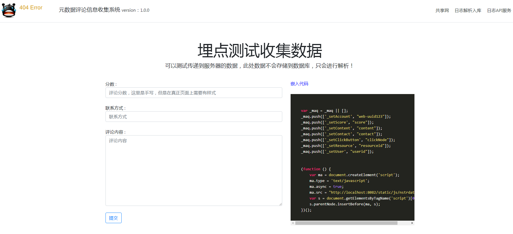
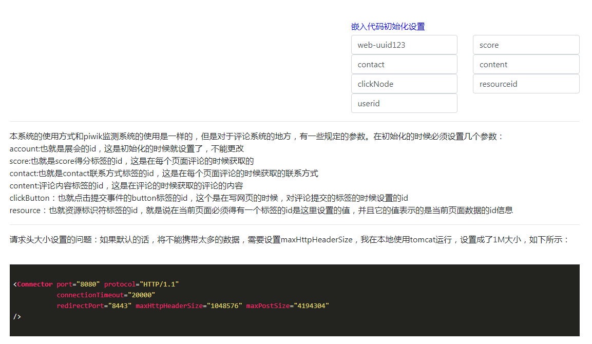
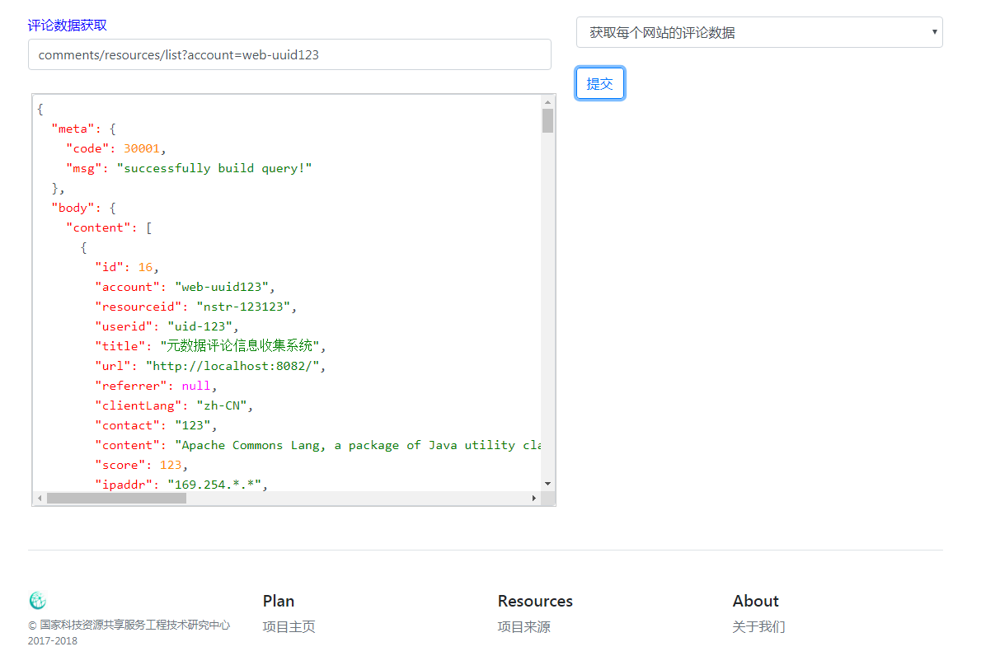

nstrdata-collection
=======================

项目来源
-----------
  
    最初的项目来源（埋点的js文件）参考了网络上找的一些代码（具体链接有点久了，忘记了，如果作者想要在这里说明，可以@me）
    
    项目里面的model和mapper部分是根据mybatis-generator()自动生成的（有些统计SQL是自己写的）。
[mybatis-generator](https://github.com/zw231212/mybatis-generator)
    
    项目里面涉及的sql请联系我获取（项目最终还未成型，对于历史数据的处理还有待处理）。


项目说明
-----------
    本项目的作用是收集评论区评论数据之用。是上级组织机构需要对下级组织的网站上的评论数据进行收集的时候，可以使用本项目来进行评论数据的搜集。
    
项目中文分词词典
-------------
[下载地址](https://github.com/NLPchina/ansj_seg)

    
项目使用说明
--------------
项目执行的js信息在static/js/nstrdata.js里面，
每个平台在加入监测之前，必须加入在元数据的评论的页面加入一段代码。
也就算是每个平台的资源评论页面必须符合下述的规范方能加入到整体的资源评论的监测之中。
同时才能更好的为各个平台做数据支持服务。评论须包含如下所示的三个部分：分数，联系方式，评论内容；
而且评论整体的数据不能多于1000个字符。其中的data-collection-domain/nstr这个是监测服务器的地址。
```html
   <script>
        var _maq = _maq || [];
       _maq.push(['_setAccount', "web-uuid123"]);  //必须,共享网的账户的id       
       _maq.push(['_setScore', "score"]);  //必须           
       _maq.push(['_setContent', "content"]);  //必须       
       _maq.push(['_setContact', "contact"]);    //必须     
       _maq.push(['_setClickButton', "clickNode"]);   //必须  
       _maq.push(['_setResource', "resourceid"]); //必须
         
       _maq.push(['_setIpPlugin', "FUZZY2"]);  //可选       
       _maq.push(['_setUser', "userid"]);  //可选    
   
   
       (function () {
           var ma = document.createElement('script');
           ma.type = 'text/javascript';
           ma.async = true;
           ma.src = "http://data-collection-domain/nstr/static/js/nstrdata.js";
           var s = document.getElementsByTagName('script')[0];
           s.parentNode.insertBefore(ma, s);
       })();
   </script>
```
其中必须设置一些参数方可使用：

| 参数设置key | 参数val解析 | 其他 |
| :------| ------: | :------: |
| _setAccount | 用户的唯一标识符，也就是平台的id信息 | 本系统不维护平台相关的信息，只做评论数据的监测与api服务 |
| _setIpPlugin | 设置ip解析的策略 |大小写不敏感， 分别是geoip（默认），ipipnet，no不启用解析，fuzzy不启用解析并且对ip最后一位进行模糊处理，最后fuzzy2表示不启用解析并且模糊后两位 |
| _setScore | 用户对资源的评分信息的标签 | 也就是系统需要根据平台提供的这个值，然后操作dom，获取信息的值:document.getElementById(scoreTagId).value; |
| _setContent | 用户对资源的评论内容标签的id | 要能够根据如下的dom操作得到评论的内容：document.getElementById(contentTagId).value; |
| _setContact | 用户的联系方式的标签id | 要能够根据如下的dom操作得到评论的内容：document.getElementById(contactTagId).value; |
| _setClickButton | 用户点击提交按钮的button的id | 要能够根据如下的dom操作进行数据的请求：document.getElementById(clickButtonId).addEventListener("click",clickHandler); |
| _setResource | 当前页面的元数据的id所在标签的id | 要能够根据如下的dom操作得到评论的内容：document.getElementById(resourceIdTagId).value;  |
| _setUser | 当前页面用户的id所在标签的id | 要能够根据如下的dom操作得到评论的内容：document.getElementById(userIdTagId).value;  |

用户提交内容后向监测服务器传送如下的一些信息

| 字段名称 | 字段类型 | 字段解释 | 字段来源 |
| :------| ------: | :------: |  :------: |
| url | string | 页面url |  自动获取 |
| title | string | 页面title | 自动获取 |
| height | int | 屏幕高 |    自动获取 |
| width | int | 屏幕宽 |     自动获取 |
| referrer | string | 网页referrer | 自动获取 |
| ua | string | user-agent |     自动获取 |
| lang | string | 客户端语言 | 自动获取 |
| account | string | 账号id |    自动获取 |
| resourceid | string | 资源标识符id | 自动获取 |
| userid | string | 用户id |     自动获取 |
| contact | string | 联系方式 |  表单内容 |
| content | string | 反馈内容 |  表单内容 |
| score | float | 反馈分数 |    表单内容，只会是1-5分，可以是小数，但是不能超过，大于5的都会是5，小于1的都是1 |

这些信息都会使用一个args的参数的值形式发送到监测数据的服务器，
服务器会对这些数据进行解析。分别是获取ip（ip会进行解析），获取用户代理（用户的额操作系统和浏览器信息）；
最终每个评论会得到如下的信息：

| 字段名称 | 字段类型 | 字段解释 |
| :------| ------: | :------: | 
| id | Long | 页面url |
| account | string | 所在组织id |
| resourceid | string | 资源标识符id |
| userid | string | 用户id |
| title | string | 用户id |
| url | string | 网页的url |
| referrer | string | 网页referrer |
| clientLang | string | 客户端语言 |
| ipaddr | string | ip信息 | 
| area | string | 国家或地区 | 
| province | string | 省份 | 
| region | string | 地市或者县区 | 
| lat | double | 经度 |
| lng | double | 维度 | 
| ua | string | user-agent | 
| browser | string | 浏览器名称|
| browserVersion | string | 浏览器版本号 |
| browserType | string | 浏览器类型 |
| os | string | 操作系统名称 |     
| osVersion | string | 操作系统版本号 |
| osType | string | 操作系统类型 |  
| contact | string | 联系方式 |
| content | string | 反馈内容 | 
| score | float | 反馈分数 |  
| createTime | Long | 创建时间 |  

    
    
系统api使用
---------





API
----
返回的数据的格式是：
```json
{
"meta":{
"code":30001,
"msg":""
},
"body":{},
"costTimeMillis":0
}
```
其中返回码是30001的表示是正确的，body里面是查询返回的数据
```js
var baseDomain = "http://localhost:8082";
var apis = [
      {
        "name":"获取本次备份周期内的评论分页数据，暂定是一月备份一次",
        "api":baseDomain+"/comments/resources/list",
        "method":"get/post",
        "params":{//请求参数
          "account":"必须，平台id信息，在埋点的时候确认的唯一的标识符",
          "resourceid":"可选，资源的id",
          "userid":"可选，用户的id",
          "number":"可选，int类型，默认0，分页页码",
          "size":"可选，int类型，默认10，分页大小",
        },
        "fields":{  //返回数据，分页信息，下面的content内容，其他字段不做解释，
            // 评论数据的详细解释见上面，这里不写第二遍
        }
      },
      {
              "name":"获取资源评论的详细数据，这里包含content，上面的分页请求不包含content，这里没有对account进行验证",
              "api":baseDomain+"/comments/resources/detail/{id}/get",
              "method":"get/post",
              "params":{//请求参数
                "id":"资源的id，在path里面"
              },
              "fields":{  //返回数据一条评论的详细信息，下面的content内容，其他字段不做解释，
                  // 评论数据的详细解释见上面，这里不写第二遍
              }
      },
    {
          "name":"获取每日每月或者每年的资源评论基本的统计数据",
          "api":baseDomain+"/comments/daily/list",
          "params":{//请求参数
                "account":"必须，平台id信息，在埋点的时候确认的唯一的标识符",
                "number":"可选，int类型，默认0，分页页码",
                "size":"可选，int类型，默认10，分页大小",
                "begin":"必须，参数说明：年份，XXXX四位数字来表示,month," +
                            "月份，不足的用0来补足,day，日期，不足2位的用0来补足，" +
                             "这里的参数是年份+月份+日期，字符串类型，中间使用横杆“-”来分割",
                "offset":"可选偏移量，也就是偏移当前月份、年份或者天数多少，整数，从0开始",
                "type":"时间类型，每年每月或者每日，分别为year，month,day",
                "sort":"排序参数，形式为：value DESC(这是默认)等",
          },
          "fields":{  //返回数据，分页数据
            "id":"id",
            "account":"account账号",
            "day":"统计日期，格式为yyyyMMdd",
            "value":"当天评论的数量",
            "createTime":"此条信息创建时间,long 类型",
            "minScore":"当天评论里的最低分数",
            "avgScore":"当天评论的平均分数",
          }
        },
        {
          "name":"获取每日每月或者每年的资源评论列统计数据，这里的列是数据评论的详情里面的列，" +
           "统计哪些列是在配置文件里面可以配置的，默认的有：" +
            "browser：浏览器, browser_type：浏览器类型,os：操作系统, os_type：操作系统类型, " +
             "area：国家或者地区, province：省份, region：区县或者城市, " +
              "resourceid：资源的id, userid：用户的id",
          "remark":"多列的统计暂时没做",
          "api":baseDomain+"/comments/daily-columns/list",
          "params":{//请求参数
                "account":"必须，平台id信息，在埋点的时候确认的唯一的标识符",
                "number":"可选，int类型，默认0，分页页码",
                "size":"可选，int类型，默认10，分页大小",
                "begin":"必须，参数说明：年份，XXXX四位数字来表示,month," +
                            "月份，不足的用0来补足,day，日期，不足2位的用0来补足，" +
                             "这里的参数是年份+月份+日期，字符串类型，中间使用横杆“-”来分割",
                "offset":"可选偏移量，也就是偏移当前月份、年份或者天数多少，整数，从0开始",
                "type":"时间类型，每年每月或者每日，分别为year，month,day",
                "sort":"排序参数，形式为：value DESC(这是默认)等",
                "columns":"可选，默认无不筛选，指定要查询的数据的列，列与列之间通过“-”来连接",
          },
          "fields":{  //返回数据，分页数据
            "id":"id",
            "account":"account账号",
            "day":"统计日期，格式为yyyyMMdd",
            "value":"当天评论的数量",
            "createTime":"此条信息创建时间,long 类型",
            "name":"列的具体数据，比如统计的列是os，那么name就有可能是windows，Linux等",
            "type":"查询的列的类型，就是统计的列",
            "avgScore":"列数据的平均分数",
          }
        },
        {
          "name":"获取每日每月或者每年的资源评论评论内容的分词数据",
          "api":baseDomain+"/comments/daily-comments/list",
          "params":{//请求参数
                "account":"必须，平台id信息，在埋点的时候确认的唯一的标识符",
                "number":"可选，int类型，默认0，分页页码",
                "size":"可选，int类型，默认10，分页大小",
                "begin":"必须，参数说明：年份，XXXX四位数字来表示,month," +
                            "月份，不足的用0来补足,day，日期，不足2位的用0来补足，" +
                             "这里的参数是年份+月份+日期，字符串类型，中间使用横杆“-”来分割",
                "offset":"可选偏移量，也就是偏移当前月份、年份或者天数多少，整数，从0开始",
                "type":"时间类型，每年每月或者每日，分别为year，month,day",
                "sort":"排序参数，形式为：value DESC(这是默认)等",
          },
          "fields":{  //返回数据，分页数据
            "id":"id",
            "account":"account账号",
            "day":"统计日期，格式为yyyyMMdd",
            "value":"当天评论的数量",
            "createTime":"此条信息创建时间,long 类型",
            "tags":"分词数据，string类型，里面的数据是json格式，" +
             "是list，[{name:'词',value:'词频'}]",
          }
        },
    ]

```
